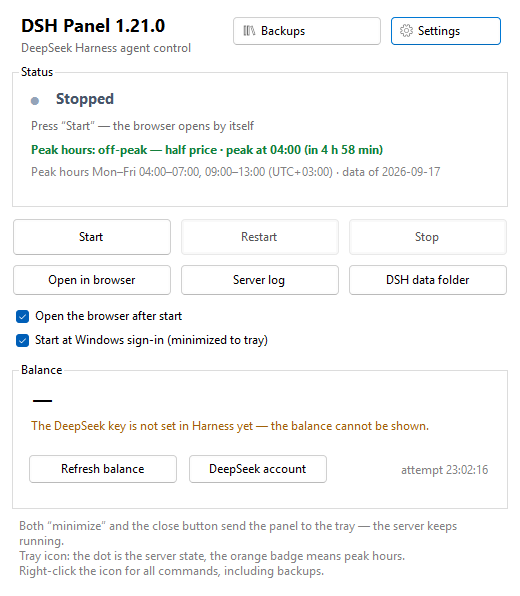

# DSH Panel

A small Windows tray app for the local **DeepSeek Harness** (DSH) server: it starts and stops the
server, opens the web interface with the sign-in link, keeps an eye on peak-hour pricing and your
account balance, and backs up your DSH data.

[Русская версия →](README.ru.md)



## What it does

- **Server.** Start, restart and stop the local DSH server without a console window; see the real
  state (running / stopped / the port is taken by another process) with the PID; open the browser
  with the sign-in link, the server log and the `.dsh` folder.
- **Tray.** The icon shows the state (green / grey dot) and peak hours (orange badge); a right click
  gives every command. Both “minimize” and the close button keep the panel in the tray — the server
  keeps running.
- **Peak hours and prices.** Peak or off-peak **in your own time zone**, when the next switch
  happens, the peak windows in local time, and the official price table as a reference. The pricing
  page is re-checked on schedule and applied **only after you confirm it**.
- **Balance.** Your account balance, read with the key from `~/.dsh/.credentials.yaml` and refreshed
  on a schedule, with a warning when it drops below the threshold you set.
- **Backups and restore.** One zip with your DSH data and the panel settings, plus a manifest with
  SHA-256 sums and a rotation policy. Optionally it carries the DSH engine and Node (a few hundred
  megabytes), so it can be restored without the internet. **Restore from a backup** is in the same
  window: pick an archive from the list or from a flash drive, see what is inside and where it goes,
  tick what to bring back — and the panel makes a copy of the current state first, so a bad restore
  can be undone.
- **Keys are never packed unless you ask.** The “Pack keys and certificates into the backup”
  checkbox is off by default; when it is on, the archive carries the folders you list and becomes a
  secret.
- **Three languages.** English, Russian and 中文 — picked from your system language, switchable in
  Settings and applied immediately.

## Requirements

- Windows 10 or 11, x64
- [.NET Desktop Runtime 8](https://dotnet.microsoft.com/download/dotnet/8.0)
- [Node.js](https://nodejs.org/) 20 or newer
- DSH itself: `npm i -g @deepseek-ai/dsh`

## Install

1. Download the installer `dsh-panel-setup.exe` from the [latest release](../../releases/latest) and
   run it — it installs per user into `%LOCALAPPDATA%\Programs\DSH Panel`, asks no administrator
   rights and offers to run the first-time wizard right away. The .NET Desktop Runtime 8 is
   **bundled inside the installer**: if the machine does not have it, the installer sets it up itself
   (Windows asks for permission — the runtime is installed for the whole machine), and the
   "no .NET needed" build is there if you would rather not install it. The wizard picks the interface
   language, checks that Node and the `dsh` package are found, and asks where DSH should run, on
   which port, whether to make backups — and whether to pack keys into them (off by default).
2. Or take the portable `DshPanel.zip`, unpack it anywhere and run `DshTray.exe` (same .NET
   requirement).
3. Or, if you would rather not install .NET at all, take `DshPanel-selfcontained.zip` — the same
   panel with the runtime inside (a much bigger download).
4. Or build it yourself — see [docs/DEVELOPMENT.md](docs/DEVELOPMENT.md).

Then press **Start**: the panel starts the server and opens the browser with the sign-in link.

Everything stays in your user profile: the installer puts the app into
`%LOCALAPPDATA%\Programs\DSH Panel` (no `Program Files`, no administrator rights), and the portable
zip leaves no traces outside its own folder. Both use the data folders below; deleting the app folder
(or uninstalling) removes the program, the data folders stay until you delete them.

## Build from source

```powershell
git clone https://github.com/Danerus23/dsh-panel.git
cd dsh-panel
powershell -NoProfile -ExecutionPolicy Bypass -File .\tools\make-release.ps1
```

The script builds the panel, runs every check, builds the installer and writes the release files into
`dist/`. What it needs besides the source: .NET SDK 8, Node.js (for the checks that talk to the
GitHub stub) and [Inno Setup 7](https://jrsoftware.org/isdl.php) — the installer is built with it.
The .NET Desktop Runtime that goes inside the installer is downloaded during the build and checked
against Microsoft's signature. Step by step details are in [docs/DEVELOPMENT.md](docs/DEVELOPMENT.md).

## Where things live

| What | Where |
| --- | --- |
| Panel settings, peak-hour windows | `%APPDATA%\DshPanel\` |
| Logs, `server.pid`, the sign-in link | `%LOCALAPPDATA%\DshPanel\` |
| Backups (folder is changeable in the window) | `Documents\DeepSeekHarness-Backups` |
| DSH data — yours, the panel only reads it | `%USERPROFILE%\.dsh` |
| Autostart entry | `HKCU\Software\Microsoft\Windows\CurrentVersion\Run` |

## Command line

| Command | What it does |
| --- | --- |
| `DshTray.exe` | open the panel |
| `--tray` | start minimized to the tray (used by autostart) |
| `--onboard` | run the first-time wizard again |
| `--status [--out file]` | print the server state, peak hours and balance |
| `--env-check [--out file]` | print what the panel found: node, the `dsh` package, the key storage, the port |
| `--lang-check` | print the same labels in all three languages (translation check) |
| `--layout-check` | check that no text is clipped in the windows in the current language |
| `--server-start` / `--server-restart` / `--server-stop` | control the server from a script (`--open` opens the browser too) |
| `--port N`, `--lang ru\|en\|zh` | server port and interface language for this run |
| `--backup [--full]` | make a backup without the window (`--full` adds the engine and Node) |
| `--backup-check [--from file] [--out file]` | verify a backup: without `--from` the newest one is used |
| `--restore [--from file] [--keys] [--no-engine]` | restore from a backup: data, panel settings and the engine; `--keys` brings keys back too |
| `--update-check [--out file]` | ask GitHub whether a newer version exists (the Updates tab shows the same) |
| `--update-prepare [--force]` | download the release, verify the sums and unpack it into the update folder (diagnostics) |
| `--install-node [--out file]` | install Node.js LTS (what the setup program calls before the first run) |
| `--node-check [--out file]` | check that the Node.js download links answer |
| `--pricing-check [--from file] [--apply]` | parse the pricing page and show what was found |
| `--selftest [--out file]` | self-check: state, icons, window |
| `--shot [file]` | save PNG pictures of the windows (used to check the UI on all languages) |
| `--icons [file]` | save a picture with every tray icon variant |
| `--wait <url>` | wait until the page starts answering (diagnostics) |
| `--help` | the same list in the console |

Environment variables: `DSH_TRAY_NODE`, `DSH_TRAY_BIN` (paths to `node.exe` and `lib\bin.js`),
`DSH_TRAY_PRICING`, `DSH_TRAY_PRICING_SOURCE`, `DSH_TRAY_BACKUP`, `DSH_TRAY_BALANCE_SCRIPT`,
`DSH_PANEL_DATA`, `DSH_PANEL_STATE` (where settings and state live), `DSH_HOME` (DSH data folder),
`DSH_PANEL_LANG` (interface language for this run), `DSH_PANEL_SSH_DIR` (the key folder, so checks
can stay away from your real `~/.ssh`).

## Backup contents

| Folder in the archive | What it is |
| --- | --- |
| `manifest.json` | the inventory: date, machine, versions, paths, every file with its SHA-256 |
| `README.txt` | the same in words, plus the restore order |
| `dsh-home/` | DSH data: settings, the model key, skills, profiles |
| `appdata/` | the panel settings |
| `keys/` | **only if you asked for it**: the key folders you listed |
| `engine/` | only in a full backup: the DSH engine and Node |

The archive is verified after writing: the file count and the first 64 MB of checksums are compared
against the inventory. When keys are packed, the archive is a secret — never share it.

Before a restore the panel writes `dsh-before-restore-<date>.zip` next to your backups (the newest
three are kept), stops its own server — DSH files must not be busy — and puts files with the same
names back, leaving everything else in place. Folders restored from `keys/` are closed to the owner
and SYSTEM only.

> **Not affiliated with DeepSeek.** DSH Panel is a community-made tray app for the DeepSeek
> Harness agent: it runs the official `dsh` command line and does not modify it. DeepSeek and
> DeepSeek Harness are trademarks of their respective owner.

## License

MIT — see [LICENSE](LICENSE).

## Screenshots

Every window is available in English, Russian and 中文 — they are taken on a separate profile, so
no personal paths or data are in them.

| | English | Русский | 中文 |
| --- | --- | --- | --- |
| Panel | [panel](docs/screenshots/en/panel.png) | [панель](docs/screenshots/ru/panel.png) | [面板](docs/screenshots/zh/panel.png) |
| Settings | [settings](docs/screenshots/en/settings.png) | [настройки](docs/screenshots/ru/settings.png) | [设置](docs/screenshots/zh/settings.png) |
| Settings (wide) | [settings](docs/screenshots/en/settings-big.png) | [настройки](docs/screenshots/ru/settings-big.png) | [设置](docs/screenshots/zh/settings-big.png) |
| Wizard: environment | [wizard](docs/screenshots/en/onboarding-env.png) | [мастер](docs/screenshots/ru/onboarding-env.png) | [向导](docs/screenshots/zh/onboarding-env.png) |
| Backups | [backups](docs/screenshots/en/backups.png) | [копии](docs/screenshots/ru/backups.png) | [备份](docs/screenshots/zh/backups.png) |
| Restore from a backup | [restore](docs/screenshots/en/restore.png) | [восстановление](docs/screenshots/ru/restore.png) | [恢复](docs/screenshots/zh/restore.png) |
| First-run wizard | [wizard](docs/screenshots/en/onboarding.png) | [мастер](docs/screenshots/ru/onboarding.png) | [向导](docs/screenshots/zh/onboarding.png) |
| Tray menu | [menu](docs/screenshots/en/menu.png) | [меню](docs/screenshots/ru/menu.png) | [菜单](docs/screenshots/zh/menu.png) |
| Prices | [prices](docs/screenshots/en/prices.png) | [цены](docs/screenshots/ru/prices.png) | [价格](docs/screenshots/zh/prices.png) |
