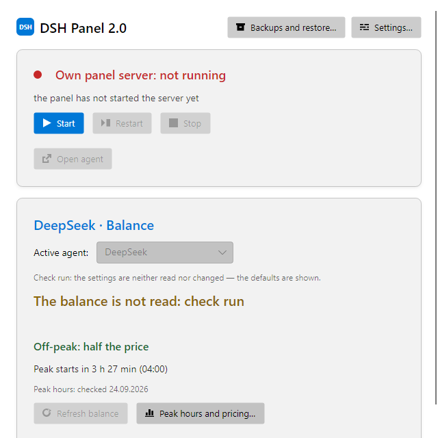

<p align="center">
  
</p>

<h1 align="center">DSH Panel</h1>

<p align="center">
  A control panel for the local <b>DeepSeek Harness</b> server on Windows:<br>
  it starts the server and watches it from the tray, shows balance and peak windows, makes and
  restores copies, and updates itself.
</p>

<p align="center">
  <a href="https://github.com/Danerus23/dsh-panel/releases/latest"></a>
  <a href="LICENSE"></a>
  
  
  <a href="https://github.com/Danerus23/dsh-panel/releases"></a>
</p>

<p align="center">
  <a href="#installation">Installation</a> ·
  <a href="#what-it-does">What it does</a> ·
  <a href="#what-is-missing">What is missing</a> ·
  <a href="#screenshots">Screenshots</a> ·
  <a href="#building-from-source">Building from source</a> ·
  <a href="#support-the-project">Support</a> ·
  <a href="README.ru.md">Русский</a> ·
  <a href="README.zh.md">中文</a>
</p>



**Your DSH server, under control** — and out of the way in the tray. One file, `DshPanel.exe`:
installed into your user profile, no administrator rights, no separate .NET install — the runtime is
inside. This panel version is **2.0.1**.

Start and stop the server, a tray icon that shows its state, your balance, peak windows and price
history, copies of your data with restore, and the panel updating itself — all of it **in three
languages: Russian, English and Chinese**.

Peak windows are shown in **your local time**, prices come with a history of changes rather than from
memory, and the sign-in link opens only when you click it.

You only need your own installed DSH: the panel manages your server, it does not bring one. For what
the panel does not do, see [“What is missing”](#what-is-missing).

Russian is the original. **English and Chinese are machine translations:** the meaning is right, but
some wording may not sound native.

## Installation

1. Download `dsh-panel-setup.exe` from the [latest release](../../releases/latest) and run it. It
   installs the panel **into your user profile** — `%LOCALAPPDATA%\Programs\DSH Panel` — and **asks
   for no administrator rights**.
2. Or take the portable `DshPanel.zip`: unpack it anywhere and run `DshPanel.exe`. That changes
   nothing on the system.
3. Then press **Start** — the panel brings up your DSH server and shows its state. The entry link
   opens in your browser from a separate button.

If you already have an **earlier panel**, the installer goes over it: both use the same package
identity, so the tray keeps one panel, not two.

**What it needs:** Windows 10 or 11, x64. No .NET install. It also needs your own installed DSH —
the engine is not bundled (see “What is missing”).

## What it does

### The server

Start, restart and stop the local DSH server. The panel shows the real state: running, stopped, or
the port taken by another program. The entry link opens in your browser **only when you click it** —
the panel never opens it by itself and never shows it. Next to it is the server log: you can read
what the server printed while starting.

### Picking up a server that is already running

If a DSH server is already up, the panel finds it on port 3080 or on another port, shows you the
finding and asks whether to take it under control. Your answer is **remembered**, so from the next
start the same server is taken automatically. While a foreign server answers, the panel does not
start its own — no second engine on the same data.

### The tray

The tray icon shows the state in colour: green — the server answers, red — it does not, grey — the
panel knows nothing about the server. A peak dot sits in the corner of the icon. Clicking the icon
opens the window, the right button opens the menu, and the menu header carries three state lines:
the server, the agent with its balance, and the tariff. Both the close button and “minimise” send
the window to the tray: the server keeps running.

### Balance and peak windows

Balance is read with the key of the active model and refreshed on a schedule. Peak windows are shown
in **your local time**. The panel tells you when a peak is about to start and when the balance falls
below your threshold, and how long is left until the tariff switches. A balloon on start says where
the panel lives.

### Prices and price history

The “Cost” table is parsed from the pricing page. Separately the panel keeps a **history of
changes**: a record appears only when prices or peak windows have **actually changed**. Each new
record is compared with the previous one, the newest is marked “current”, a price rise is shown in
red with an up arrow and a drop in green with a down arrow. When something changes, the balloon says
**what exactly** changed.

### Copies and restore

A copy of your DSH data is a ZIP archive. The panel lists the copies it has, and before restoring it
lays out a plan: what exactly will come back and where, changing nothing on disk. Restoring takes a
safety copy of the current state first, automatic copies are taken on a schedule and rotated, and
the size of a copy is one of three modes. **Private keys** outside `~/.dsh` go into a copy only with a
separate permission, and then the archive itself becomes the key. A **“copy to hand over”** is a
one-off action, not a setting: the checkbox in the copies window clears itself after the copy, a copy
without a window has its own `--shareable` switch, and scheduled copies are never shareable. The
access-key file is not put into such a copy at all, so it can be given to another person. **Private
keys together with a copy to hand over are refused** — the panel says why, in words.

### Updating itself

The panel asks for releases once a day, shows the release notes **in the panel's own language** and
can “skip this version”. What it downloads is checked against SHA-256, unpacked with a version
check, and the files are replaced by a separate script **that can roll back** to the previous
version. The panel then tells you the outcome in words: updated, rolled back, or the panel folder
was not the one it replaced.

### Three languages

Russian, English and Chinese. The language switch is in the settings.

### Reporting a problem

The “About” window has a report button. The panel assembles a technical report and **shows you
exactly the text that will leave**. Nothing is sent on its own: the report goes out only when you
press a button — open a new issue in your browser, copy it, or save it to a file. The model key,
the balance and the entry link never get into the report.

### Settings

Start with Windows, theme (light, dark, or as in Windows), the port of the panel's own server, and
the server working folder. The “Server” section carries an environment report: what the panel
looked for, what it found, which versions of DSH, Node, npm and pnpm are installed and where exactly
— with paths.

## What is missing

* **You need your own installed DSH.** No engine and no Node come with the download: the panel
  manages your server, it does not bring one. Your own DSH is what makes the server start and what
  fills the environment report.
* **There is no code signing — SmartScreen will warn you.** On the first run it will say the
  publisher is unknown: no signing certificate was bought. That is expected; you can still run the
  installer through “More info” → “Run anyway”.
* **The panel updates only itself.** It does not update DSH itself — DSH updates on its own.
* **The peak schedule is weekly.** The table runs by days of the week, the same as on the pricing
  page, and knows no Chinese holidays.

## Screenshots

Every window comes in all three languages — the language switch lives in the settings.


Several panel windows at once.

| | English | Русский | 中文 |
| --- | --- | --- | --- |
| Main window | [panel](docs/screenshots/en/panel.png) | [панель](docs/screenshots/ru/panel.png) | [面板](docs/screenshots/zh/panel.png) |
| Peaks and prices | [peaks](docs/screenshots/en/peaks.png) | [пики](docs/screenshots/ru/peaks.png) | [价格高峰](docs/screenshots/zh/peaks.png) |
| Price history | [price history](docs/screenshots/en/pricing-history.png) | [история цен](docs/screenshots/ru/pricing-history.png) | [价格历史](docs/screenshots/zh/pricing-history.png) |
| Settings | [settings](docs/screenshots/en/settings.png) | [настройки](docs/screenshots/ru/settings.png) | [设置](docs/screenshots/zh/settings.png) |
| About | [about](docs/screenshots/en/about.png) | [о программе](docs/screenshots/ru/about.png) | [关于](docs/screenshots/zh/about.png) |
| Panel update | [update](docs/screenshots/en/update.png) | [обновление](docs/screenshots/ru/update.png) | [更新](docs/screenshots/zh/update.png) |

## Building from source

```powershell
git clone https://github.com/Danerus23/dsh-panel.git
cd dsh-panel

dotnet build DshPanel.slnx -c Release
dotnet test tests\DshPanel.Tests\DshPanel.Tests.csproj -c Release
dotnet publish src\DshPanel\DshPanel.csproj -p:PublishProfile=win-x64 -o dist
```

The publish profile produces a single self-contained `DshPanel.exe` with .NET, Skia and HarfBuzz
inside — the machine that runs it needs no .NET install.

Building needs the **.NET SDK 10** (the version is pinned in `global.json`) and a network
connection, because packages come from NuGet. The installer is built by
[Inno Setup 7](https://jrsoftware.org/isdl.php) through `installer\build-installer.ps1`, which also
places the release file in `dist\`. The build itself needs no Node and no pnpm — those bring the
server up, they do not build the panel.

## Support the project

The panel is free, open and will stay that way — there is no paid version and none is planned;
donations cover development time: code, builds and checks on clean Windows go through
[lava.top](https://app.lava.top/3686297587).

> **Unofficial tool.** DSH Panel is a panel for the DeepSeek Harness agent: it runs the official
> `dsh` command line and does not change it. DeepSeek and DeepSeek Harness are trademarks of their
> owner.

## License

MIT — see [LICENSE](LICENSE).
