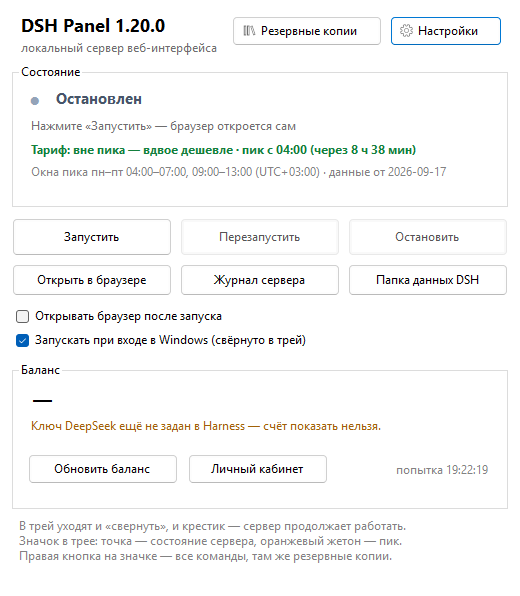

# DSH Panel

Небольшое приложение в трее Windows для локального сервера **DeepSeek Harness** (DSH): поднимает
и останавливает сервер, открывает веб-интерфейс со ссылкой для входа, следит за тарифом пик-часов
и балансом счёта и делает резервные копии данных DSH.

[English version →](README.md)



## Что умеет

- **Сервер.** Запуск, перезапуск и остановка локального сервера DSH без окна консоли; настоящее
  состояние (работает / остановлен / порт занят другим процессом) с PID; открытие браузера по
  ссылке для входа, журнала сервера и папки `.dsh`.
- **Трей.** Значок показывает состояние (зелёная или серая точка) и пик-часы (оранжевый жетон);
  правая кнопка — все команды. И «свернуть», и крестик убирают панель в трей, сервер продолжает
  работать.
- **Пик-часы и цены.** Пик или вне пика **по твоему часовому поясу**, когда следующее переключение,
  окна пика по местному времени и официальная таблица цен как справка. Страница цен проверяется по
  расписанию и применяется **только после подтверждения**.
- **Баланс.** Счёт по ключу из `~\.dsh\.credentials.yaml`, обновление по расписанию и
  предупреждение, когда баланс опускается ниже выставленного порога.
- **Резервные копии и восстановление.** Один zip с данными DSH и настройками панели, с описью
  и контрольными суммами SHA-256 и с ротацией. По желанию — вместе с движком DSH и Node (сотни
  мегабайт), тогда копия восстанавливается без интернета. **Восстановить из копии** можно там же:
  выбрать архив из списка или с флешки, увидеть, что внутри и куда ляжет, отметить, что вернуть, —
  а перед накатом панель сделает копию текущего состояния, поэтому неудачный накат откатывается.
- **Ключи не копируются, пока не попросишь.** Галочка «Упаковывать в копию ключи и сертификаты»
  выключена по умолчанию; если включить — в архив попадут указанные каталоги, и архив становится
  секретом.
- **Три языка.** Русский, English и 中文 — по языку системы, переключаются в «Настройках»
  и применяются сразу.

## Что нужно

- Windows 10 или 11, x64
- [.NET Desktop Runtime 8](https://dotnet.microsoft.com/download/dotnet/8.0)
- [Node.js](https://nodejs.org/) 20 или новее
- Сам DSH: `npm i -g @deepseek-ai/dsh`

## Установка

1. Скачай установщик `dsh-panel-setup.exe` из [последнего выпуска](../../releases/latest) и запусти
   его — он ставится **для текущего пользователя** в `%LOCALAPPDATA%\Programs\DSH Panel`, прав
   администратора не просит и сразу предлагает запустить мастер первой настройки. Среда
   .NET Desktop Runtime 8 **лежит внутри установщика**: если её на машине нет, он поставит её сам
   (Windows спросит разрешение — среда ставится для всей машины), а если ставить не хочется, всегда
   можно взять сборку «без .NET». Мастер определит
   язык интерфейса, проверит, что Node и пакет `dsh` на месте, и спросит, где должен работать DSH,
   на каком порту, делать ли резервные копии — и упаковывать ли в них ключи (по умолчанию нет).
2. Либо возьми переносимый `DshPanel.zip`, распакуй в любую папку и запусти `DshTray.exe`
   (требование к .NET то же).
3. Либо, если не хочется ставить .NET, возьми `DshPanel-selfcontained.zip` — та же панель,
   но со средой выполнения внутри (скачивать заметно больше).
4. Либо собери сам — см. [docs/DEVELOPMENT.md](docs/DEVELOPMENT.md).

Потом нажми **«Запустить»**: панель поднимет сервер и откроет браузер по ссылке для входа.

Всё остаётся в профиле пользователя: установщик кладёт программу в
`%LOCALAPPDATA%\Programs\DSH Panel` (без `Program Files` и без прав администратора), а переносимый
архив не оставляет следов вне своей папки. Данные лежат в папках ниже; удаление программы (или
удаление через «Программы и компоненты») убирает саму панель, папки данных остаются, пока их не
удалишь сам.

## Сборка из исходников

```powershell
git clone https://github.com/Danerus23/dsh-panel.git
cd dsh-panel
powershell -NoProfile -ExecutionPolicy Bypass -File .\tools\make-release.ps1
```

Скрипт собирает панель, прогоняет все проверки, собирает установщик и складывает файлы выпуска в
`dist/`. Кроме исходников нужны: .NET SDK 8, Node.js (для проверок, которые работают с заглушкой
GitHub) и [Inno Setup 7](https://jrsoftware.org/isdl.php) — им собирается установщик. Среда .NET,
которая кладётся внутрь установщика, скачивается при сборке и проверяется по подписи Microsoft.
Подробности по шагам — в [docs/DEVELOPMENT.md](docs/DEVELOPMENT.md).

## Где что лежит

| Что | Где |
| --- | --- |
| Настройки панели, окна пика | `%APPDATA%\DshPanel\` |
| Журналы, `server.pid`, ссылка для входа | `%LOCALAPPDATA%\DshPanel\` |
| Резервные копии (папку можно сменить в окне) | `Документы\DeepSeekHarness-Backups` |
| Данные DSH — твои, панель их только читает | `%USERPROFILE%\.dsh` |
| Запись автозапуска | `HKCU\Software\Microsoft\Windows\CurrentVersion\Run` |

## Командная строка

| Команда | Что делает |
| --- | --- |
| `DshTray.exe` | открыть панель |
| `--tray` | запуститься свёрнутым в трей (для автозапуска) |
| `--onboard` | снова показать мастер первой настройки |
| `--status [--out файл]` | напечатать состояние сервера, тариф и баланс |
| `--env-check [--out файл]` | напечатать, что панель нашла: node, пакет `dsh`, хранилище с ключом, порт |
| `--lang-check` | показать одни и те же подписи на трёх языках (проверка переводов) |
| `--layout-check` | проверить, не обрезан ли текст в окнах на текущем языке |
| `--server-start` / `--server-restart` / `--server-stop` | управлять сервером из скрипта (`--open` ещё и откроет браузер) |
| `--port N`, `--lang ru\|en\|zh` | порт сервера и язык интерфейса на один запуск |
| `--backup [--full]` | сделать копию без окна (`--full` — с движком и Node) |
| `--backup-check [--from файл] [--out файл]` | проверить копию (без `--from` — самую свежую) |
| `--pricing-check [--from файл] [--apply]` | разобрать страницу цен и показать, что нашлось |
| `--restore [--from файл] [--keys] [--no-engine]` | вернуть данные из копии: данные, настройки панели и движок; `--keys` возвращает ещё и ключи |
| `--update-check [--out файл]` | спросить GitHub, есть ли версия новее (то же показывает вкладка «Обновления») |
| `--install-node [--out файл]` | поставить Node.js LTS (этим пользуется установщик перед первым запуском) |
| `--selftest [--out файл]` | самопроверка: состояние, значки, окно |
| `--shot [файл]` | сохранить PNG-снимки окон (проверка вида на всех языках) |
| `--icons [файл]` | сохранить картинку со всеми вариантами значка трея |
| `--wait <ссылка>` | дождаться, пока страница начнёт отвечать (диагностика) |
| `--help` | тот же список в консоли |

Переменные окружения: `DSH_TRAY_NODE`, `DSH_TRAY_BIN` (пути к `node.exe` и `lib\bin.js`),
`DSH_TRAY_PRICING`, `DSH_TRAY_PRICING_SOURCE`, `DSH_TRAY_BACKUP`, `DSH_TRAY_BALANCE_SCRIPT`,
`DSH_PANEL_DATA`, `DSH_PANEL_STATE` (где лежат настройки и состояние), `DSH_HOME` (папка данных
DSH), `DSH_PANEL_LANG` (язык интерфейса на один запуск), `DSH_PANEL_SSH_DIR` (каталог ключей, чтобы
проверки не задевали настоящий `~/.ssh`).

## Что внутри копии

| Папка в архиве | Что это |
| --- | --- |
| `manifest.json` | опись: дата, машина, версии, пути, каждый файл с суммой SHA-256 |
| `README.txt` | то же словами и порядок восстановления |
| `dsh-home/` | данные DSH: настройки, ключ модели, навыки, профили |
| `appdata/` | настройки панели |
| `keys/` | **только если попросил**: указанные каталоги с ключами |
| `engine/` | только в полной копии: движок DSH и Node |

Копия проверяется сразу после записи: число файлов и первые 64 МБ контрольных сумм сверяются
с описью. Если ключи упакованы — архив является секретом, передавать его нельзя.

> **Инструмент неофициальный.** DSH Panel — панель, сделанная сообществом для агента DeepSeek
> Harness: она запускает официальную командную строку `dsh` и не меняет её. DeepSeek и DeepSeek
> Harness — товарные знаки их владельца.

## Лицензия

MIT — см. [LICENSE](LICENSE).

## Снимки окон

Все окна есть на русском, английском и китайском. Снимки сделаны на отдельном профиле,
поэтому личных путей и данных в них нет.

| | English | Русский | 中文 |
| --- | --- | --- | --- |
| Панель | [panel](docs/screenshots/en/panel.png) | [панель](docs/screenshots/ru/panel.png) | [面板](docs/screenshots/zh/panel.png) |
| Настройки | [settings](docs/screenshots/en/settings.png) | [настройки](docs/screenshots/ru/settings.png) | [设置](docs/screenshots/zh/settings.png) |
| Копии | [backups](docs/screenshots/en/backups.png) | [копии](docs/screenshots/ru/backups.png) | [备份](docs/screenshots/zh/backups.png) |
| Восстановление из копии | [restore](docs/screenshots/en/restore.png) | [восстановление](docs/screenshots/ru/restore.png) | [恢复](docs/screenshots/zh/restore.png) |
| Мастер | [wizard](docs/screenshots/en/onboarding.png) | [мастер](docs/screenshots/ru/onboarding.png) | [向导](docs/screenshots/zh/onboarding.png) |
| Меню трея | [menu](docs/screenshots/en/menu.png) | [меню](docs/screenshots/ru/menu.png) | [菜单](docs/screenshots/zh/menu.png) |
| Цены | [prices](docs/screenshots/en/prices.png) | [цены](docs/screenshots/ru/prices.png) | [价格](docs/screenshots/zh/prices.png) |
