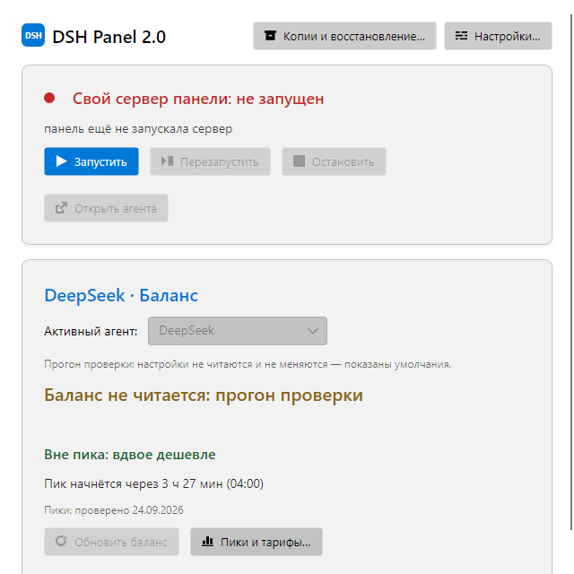
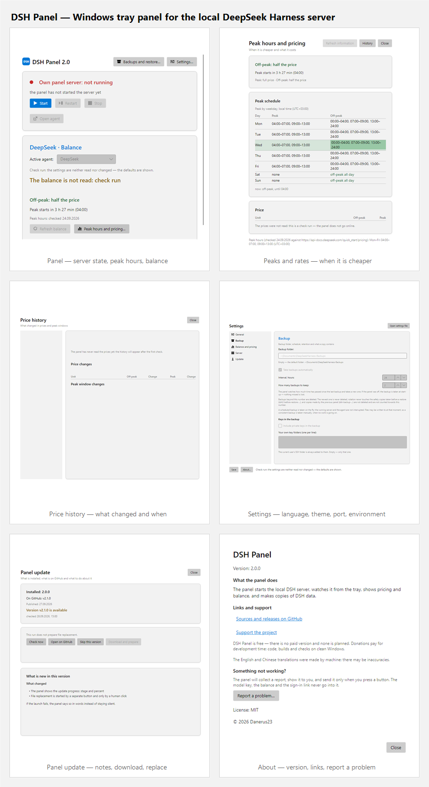

<p align="center">
  
</p>

<h1 align="center">DSH Panel</h1>

<p align="center">
  Панель управления локальным сервером <b>DeepSeek Harness</b> для Windows:<br>
  поднимает сервер и следит за ним из трея, показывает баланс и окна пика, делает и возвращает копии,
  обновляет себя.
</p>

<p align="center">
  <a href="https://github.com/Danerus23/dsh-panel/releases/latest"></a>
  <a href="LICENSE"></a>
  
  
  <a href="https://github.com/Danerus23/dsh-panel/releases"></a>
</p>

<p align="center">
  <a href="#установка">Установка</a> ·
  <a href="#что-умеет">Что умеет</a> ·
  <a href="#чего-нет">Чего нет</a> ·
  <a href="#снимки-окон">Снимки окон</a> ·
  <a href="#сборка-из-исходников">Сборка из исходников</a> ·
  <a href="#поддержать-проект">Поддержать</a> ·
  <a href="README.md">English version</a> ·
  <a href="README.zh.md">中文</a>
</p>



Версия панели — **2.0.0**. Один файл `DshPanel.exe`, ставится в профиль пользователя, права
администратора не нужны, .NET ставить не надо — он внутри.

Панель говорит на трёх языках — **русский, английский, китайский**. Русский — язык оригинала,
а **английский и китайский переведены машинно**: смысл передан верно, но отдельные формулировки
могут звучать не по-родному.

## Установка

1. Скачайте установщик `dsh-panel-setup.exe` из [последнего выпуска](../../releases/latest) и
   запустите его. Он ставит панель **в профиль текущего пользователя** —
   `%LOCALAPPDATA%\Programs\DSH Panel` — и **прав администратора не просит**.
2. Либо возьмите переносимый архив `DshPanel.zip`: распакуйте в любую папку и запустите
   `DshPanel.exe`. Установка при этом ничего не меняет.
3. Затем нажмите **«Запустить»** — панель поднимет ваш сервер DSH и покажет состояние. Ссылка
   входа откроется в браузере по отдельной кнопке.

Панель 2.0 встаёт **поверх панели 1.x**: у них один идентификатор пакета, поэтому в трее
остаётся одна панель, а не две.

**Что нужно:** Windows 10 или 11, x64. .NET ставить не нужно. Нужен свой установленный DSH — в
раздаче его нет (см. «Чего нет»).

## Что умеет

### Сервер

Запуск, перезапуск и остановка локального сервера DSH. Панель показывает настоящее состояние:
работает, остановлен или порт занят чужой программой. Ссылка входа открывается в браузере
**только по щелчку** — сама панель её никуда не отправляет и не показывает. Рядом лежит журнал
сервера: видно, что он печатал при запуске.

### Подхват уже работающего DSH

Если сервер DSH уже поднят — панель находит его на порту 3080 или на другом порту, показывает
находку и спрашивает, брать ли её под управление. Ответ **запоминается**: со следующего запуска
тот же сервер берётся сам. Пока рядом отвечает чужой сервер, свой панель не поднимает — второго
движка на тех же данных не появляется.

### Трей

Значок в трее показывает состояние цветом: зелёный — сервер отвечает, красный — нет, серый —
панель про сервер ничего не знает. В углу значка — огонёк пика. Щелчок по значку открывает окно,
правая кнопка — меню, а в шапке меню три строки состояния: сервер, агент с балансом и тариф.
И крестик, и «свернуть» убирают окно в трей: сервер при этом продолжает работать.

### Баланс и пики

Баланс по ключу активной модели, обновляется по расписанию. Окна пика показываются **по вашему
местному времени**. Панель уведомляет, что скоро начнётся пик и что баланс опустился ниже
порога, и говорит, сколько осталось до переключения тарифа. О запуске панели сообщает шарик —
чтобы было понятно, где она живёт.

### Тарифы и история цен

Таблица «Стоимость» собирается со страницы цен. Отдельно ведётся **история изменений**: запись
появляется только тогда, когда цены или окна пика **действительно изменились**. Новая запись
сравнивается с предыдущей, свежая подписана «текущие», подорожание показано красным вверх,
удешевление — зелёным вниз. Шарик при изменении называет, **что именно** изменилось.

### Копии и восстановление

Копия данных DSH — это архив ZIP. Панель показывает список копий, а перед восстановлением
раскладывает план: что именно вернётся и куда, ничего не меняя на диске. Восстановление идёт с
предохранительной копией текущего состояния, автоматические копии снимаются по расписанию и
ротируются, а объём копии выбирается одним из трёх режимов. **Приватные ключи** вне `~/.dsh`
попадают в копию только по отдельному разрешению, и тогда ключом доступа становится сам архив.
**«Копия для передачи» — разовое действие, а не настройка:** галочка в окне копий снимается сама
после копии, у копии без окна есть свой ключ `--shareable`, а ночные копии передаваемыми не
бывают никогда. В такую копию файл ключей доступа не кладётся вовсе, поэтому её можно отдать
другому человеку. Сочетание «приватные ключи + передача» панель запрещает — отказывает словами.

### Обновление себя

Панель сама спрашивает выпуски раз в сутки, показывает заметки к выпуску **на языке панели** и
умеет «пропустить эту версию». Скачанное проверяется по SHA-256, распаковывается со сверкой
версии, а файлы заменяет отдельный сценарий **с откатом** на прежнюю версию. Итог замены панель
сообщает словами: обновилось, откатилось или не нашлась та папка.

### Три языка

Русский, английский и китайский. Язык выбирается в настройках.

### Сообщить о проблеме

В окне «О программе» есть кнопка отчёта. Панель собирает технический отчёт и **показывает вам
ровно тот текст, который уйдёт**. Отправки «сами собой» нет: отчёт уходит только по вашему
нажатию — открыть страницу нового issue в браузере, скопировать или сохранить в файл. Ключ
модели, баланс и ссылка входа в отчёт не попадают.

### Настройки

Автозапуск при входе в Windows, тема (светлая, тёмная или как в Windows), порт своего сервера и
рабочая папка сервера. В разделе «Сервер» лежит отчёт окружения: что панель искала, что нашла,
какие версии DSH, Node, npm и pnpm и где именно — с путями.

## Чего нет

Это сказано прямо, чтобы не было неожиданностей:

* **Движка DSH и Node в раздаче нет.** Панель их не везёт: нужен свой установленный DSH. У панели
  1.x установщик ставил и движок, и Node — здесь этого нет.
* **Подписи кода нет вовсе.** При первом запуске SmartScreen будет предупреждать о неизвестном
  издателе. Это ожидаемо: сертификат подписи не покупался.
* **Обновления самого DSH нет.** Панель обновляет только себя.
* **Таблица пиков не знает китайских праздников.** Расписание недельное — так оно и на странице
  цен.

## Снимки окон

Все окна есть на трёх языках. Снимки сделаны на демонстрационном профиле.



Несколько окон панели разом.

| | English | Русский | 中文 |
| --- | --- | --- | --- |
| Главное окно | [panel](docs/screenshots/en/panel.png) | [панель](docs/screenshots/ru/panel.png) | [面板](docs/screenshots/zh/panel.png) |
| Пики и тарифы | [peaks](docs/screenshots/en/peaks.png) | [пики](docs/screenshots/ru/peaks.png) | [价格高峰](docs/screenshots/zh/peaks.png) |
| История цен | [price history](docs/screenshots/en/pricing-history.png) | [история цен](docs/screenshots/ru/pricing-history.png) | [价格历史](docs/screenshots/zh/pricing-history.png) |
| Настройки | [settings](docs/screenshots/en/settings.png) | [настройки](docs/screenshots/ru/settings.png) | [设置](docs/screenshots/zh/settings.png) |
| О программе | [about](docs/screenshots/en/about.png) | [о программе](docs/screenshots/ru/about.png) | [关于](docs/screenshots/zh/about.png) |
| Обновление панели | [update](docs/screenshots/en/update.png) | [обновление](docs/screenshots/ru/update.png) | [更新](docs/screenshots/zh/update.png) |

## Сборка из исходников

```powershell
git clone https://github.com/Danerus23/dsh-panel.git
cd dsh-panel

dotnet build DshPanel.slnx -c Release
dotnet test tests\DshPanel.Tests\DshPanel.Tests.csproj -c Release
dotnet publish src\DshPanel\DshPanel.csproj -p:PublishProfile=win-x64 -o dist
```

Профиль публикации сам собирает один самодостаточный `DshPanel.exe` со средой .NET, Skia и
HarfBuzz внутри — ставить .NET на машину, где он запускается, не нужно.

Для сборки нужен **.NET SDK 10** (версия закреплена в `global.json`) и интернет: пакеты
восстанавливаются из NuGet. Установщик собирается [Inno Setup 7](https://jrsoftware.org/isdl.php)
скриптом `installer\build-installer.ps1`, и он же кладёт в `dist\` файл выпуска. Node и pnpm —
это то, чем поднимается сервер, а не то, чем собирается панель.

## Поддержать проект

Панель бесплатна, открыта и такой останется — платной версии нет и не планируется; донаты идут на
время разработки: код, сборки и проверки на чистой Windows идут через
[lava.top](https://app.lava.top/3686297587).

> **Инструмент неофициальный.** DSH Panel — панель для агента DeepSeek Harness: она запускает
> официальную командную строку `dsh` и не меняет её. DeepSeek и DeepSeek Harness — товарные знаки
> их владельца.

## Лицензия

MIT — см. [LICENSE](LICENSE).
