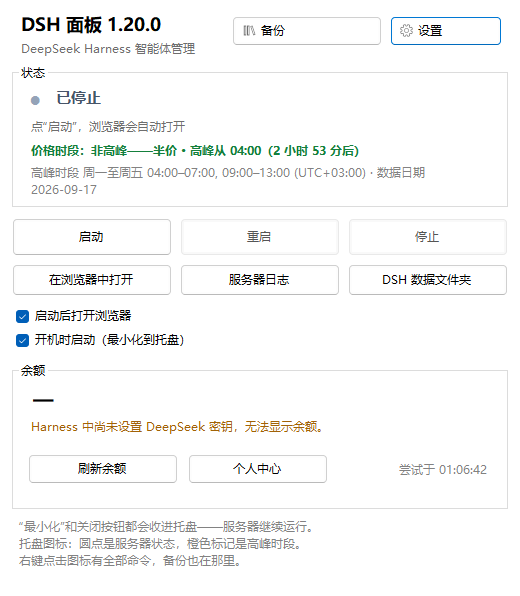

<p align="center">
  
</p>

<h1 align="center">DSH Panel</h1>

<p align="center">
  Windows 上的 <b>DeepSeek Harness</b> 智能体面板：<br>
  启停本地服务器、跟踪费率与余额、创建并还原备份。
</p>

<p align="center">
  <a href="https://github.com/Danerus23/dsh-panel/releases/latest"></a>
  <a href="https://github.com/Danerus23/dsh-panel/actions/workflows/build.yml"></a>
  <a href="LICENSE"></a>
  
  
  <a href="https://github.com/Danerus23/dsh-panel/releases"></a>
</p>

<p align="center">
  <a href="#安装">安装</a> ·
  <a href="#功能">功能</a> ·
  <a href="#界面截图">截图</a> ·
  <a href="#从源码构建">从源码构建</a> ·
  <a href="#支持项目">支持项目</a> ·
  <a href="README.md">English version</a> ·
  <a href="README.ru.md">Русская версия</a>
</p>



## 功能

- **服务器。** 启动、重启和停止本地 DSH 服务器，全程不弹控制台窗口；显示真实状态（运行中 /
  已停止 / 端口被其他进程占用）和 PID；一键打开登录链接、服务器日志和 `.dsh` 文件夹。
- **托盘。** 图标显示状态（绿点或灰点）与峰值时段（橙色角标）；右键菜单里有全部命令。点「最小化」
  和点关闭按钮一样只是把面板收进托盘，服务器继续运行。
- **峰值时段与价格。** **按你所在时区**判断当前是峰值还是非峰值、下一次切换在什么时候、峰值窗口
  换算成本地时间，并附上官方价格表供参考。价格页面会按计划重新抓取，**只有你确认之后**才会生效。
- **余额。** 用 `~\.dsh\.credentials.yaml` 里的密钥查询账户余额，按计划自动刷新，余额低于你设定
  的阈值时给出提醒。
- **备份与恢复。** 一个 zip 装下 DSH 数据和面板设置，里面有清单和 SHA-256 校验和，并按策略轮换。
  也可以选择把 DSH 引擎和 Node 一起打包（几百兆），这样的备份不需要联网就能恢复。同一个窗口里
  就能**从备份恢复**：从列表或 U 盘里选一个归档，看清楚里面有什么、会落到哪里，勾选要还原的
  内容；回滚之前面板会先备份当前状态，所以失败的恢复可以退回去。
- **不问就不打包密钥。** 「把密钥和证书打包进备份」默认关闭；一旦勾选，指定的目录就会进入归档，
  这个归档也就成了机密。
- **三种语言。** 中文、English 和 Русский —— 跟随系统语言，可在「设置」里切换，立即生效。

## 系统要求

- Windows 10 或 11，x64
- [.NET Desktop Runtime 8](https://dotnet.microsoft.com/download/dotnet/8.0)
- [Node.js](https://nodejs.org/) 20 或更高版本
- DSH 本体：`npm i -g @deepseek-ai/dsh`

## 安装

1. 从[最新发行版](../../releases/latest)下载安装程序 `dsh-panel-setup.exe` 并运行 —— 它**只为当前
   用户**安装到 `%LOCALAPPDATA%\Programs\DSH Panel`，不要求管理员权限，安装完会直接提议打开首次
   启动向导。.NET Desktop Runtime 8 **已经打包在安装程序里面**：本机没有时会由它自行安装
   （Windows 会弹窗征得同意 —— 运行库是按整机安装的）；如果不想装，随时可以改用「免 .NET」那个
   版本。向导会识别界面语言，检查 Node 和 `dsh` 包是否就绪，然后询问 DSH 应该在哪里运行、用哪个
   端口、是否创建备份 —— 以及是否把密钥一起打包进备份（默认不打包）。
2. 或者使用便携版 `DshPanel.zip`，解压到任意文件夹，运行 `DshTray.exe`（对 .NET 的要求相同）。
3. 或者，如果不想安装 .NET，就用 `DshPanel-selfcontained.zip` —— 同一个面板，只是运行库也打在
   里面（下载体积明显更大）。
4. 或者自己构建 —— 见 [docs/DEVELOPMENT.md](docs/DEVELOPMENT.md)。

接下来点 **「启动」**：面板会拉起服务器，并用登录链接打开浏览器。

所有内容都留在用户配置目录里：安装程序把程序装到 `%LOCALAPPDATA%\Programs\DSH Panel`
（不碰 `Program Files`，也不需要管理员权限），便携版解压后不会在自己的文件夹之外留下任何东西。
数据放在下面列出的目录中；删除程序（或在「程序和功能」里卸载）只会移除面板本身，数据目录会一直
保留，直到你自己删掉。

## 从源码构建

```powershell
git clone https://github.com/Danerus23/dsh-panel.git
cd dsh-panel
powershell -NoProfile -ExecutionPolicy Bypass -File .\tools\make-release.ps1
```

脚本会构建面板、跑完全部检查、做出安装程序，并把发行文件放进 `dist/`。除源码外还需要：.NET SDK 8、
Node.js（用于那些要和 GitHub 桩服务打交道的检查）以及 [Inno Setup 7](https://jrsoftware.org/isdl.php)
——安装程序由它来打包。塞进安装程序里的那个 .NET 运行库在构建时下载，并按 Microsoft 的签名校验。
分步细节见 [docs/DEVELOPMENT.md](docs/DEVELOPMENT.md)。

## 文件位置

| 内容 | 位置 |
| --- | --- |
| 面板设置、峰值时段 | `%APPDATA%\DshPanel\` |
| 日志、`server.pid`、登录链接 | `%LOCALAPPDATA%\DshPanel\` |
| 备份（目录可以在窗口里改） | `文档\DeepSeekHarness-Backups` |
| DSH 数据 —— 属于你，面板只读不写 | `%USERPROFILE%\.dsh` |
| 开机自启动项 | `HKCU\Software\Microsoft\Windows\CurrentVersion\Run` |

## 命令行

| 命令 | 作用 |
| --- | --- |
| `DshTray.exe` | 打开面板 |
| `--tray` | 启动后直接收进托盘（供自启动使用） |
| `--onboard` | 再次打开首次启动向导 |
| `--status [--out 文件]` | 打印服务器状态、费率和余额 |
| `--env-check [--out 文件]` | 打印面板找到的东西：node、`dsh` 包、密钥存储、端口 |
| `--lang-check` | 用三种语言列出同一批标签（检查翻译） |
| `--layout-check` | 检查当前语言下面板文字有没有被截断 |
| `--server-start` / `--server-restart` / `--server-stop` | 在脚本里控制服务器（加 `--open` 还会打开浏览器） |
| `--port N`、`--lang ru\|en\|zh` | 本次运行使用的服务器端口和界面语言 |
| `--backup [--full]` | 不开窗口直接做备份（`--full` 连引擎和 Node 一起打包） |
| `--backup-check [--from 文件] [--out 文件]` | 校验备份（不带 `--from` 就检查最新的那份） |
| `--pricing-check [--from 文件] [--apply]` | 解析价格页面并显示抓到的内容 |
| `--restore [--from 文件] [--keys] [--no-engine]` | 从备份还原：数据、面板设置和引擎；`--keys` 连密钥一起还原 |
| `--hidden` | 与 `--tray` 相同：启动时最小化到托盘（自启动使用） |
| `--no-safety` | 恢复时不创建当前状态的安全备份 |
| `--no-settings` | 恢复时不动面板设置 |
| `--update-check [--out 文件]` | 向 GitHub 查询有没有更新的版本（「更新」标签页显示的是同一结果） |
| `--update-prepare [--force]` | 下载发行版、核对校验和并解压到更新目录（诊断用） |
| `--install-node [--out 文件]` | 安装 Node.js LTS（安装程序在首次启动前会调用它） |
| `--node-check [--out 文件]` | 检查 Node.js 下载链接是否可访问 |
| `--selftest [--out 文件]` | 自检：状态、图标、窗口 |
| `--shot [文件]` | 保存窗口的 PNG 截图（用于检查各语言下的界面） |
| `--icons [文件]` | 保存一张包含全部托盘图标样式的图片 |
| `--wait <链接>` | 等待页面开始响应（诊断用） |
| `--help` | 在控制台里显示同一份列表 |

环境变量：`DSH_TRAY_NODE`、`DSH_TRAY_BIN`（指向 `node.exe` 和 `lib\bin.js` 的路径）、
`DSH_TRAY_PRICING`、`DSH_TRAY_PRICING_SOURCE`、`DSH_TRAY_BACKUP`、`DSH_TRAY_BALANCE_SCRIPT`、
`DSH_PANEL_DATA`、`DSH_PANEL_STATE`（设置和状态存放的位置）、`DSH_HOME`（DSH 数据目录）、
`DSH_PANEL_LANG`（本次运行的界面语言）、`DSH_PANEL_SSH_DIR`（密钥目录，让检查不去动真正的
`~/.ssh`）。

## 备份里有什么

| 归档中的目录 | 说明 |
| --- | --- |
| `manifest.json` | 清单：日期、机器、版本、路径，以及每个文件和它的 SHA-256 |
| `README.txt` | 同样的内容用文字写一遍，外加恢复顺序 |
| `dsh-home/` | DSH 数据：设置、模型密钥、技能、配置档案 |
| `appdata/` | 面板设置 |
| `keys/` | **只有你要求时才有**：你指定的那些密钥目录 |
| `engine/` | 仅完整备份有：DSH 引擎和 Node |

备份写完会立刻校验：文件数量和前 64 MB 的校验和会与清单比对。如果打包了密钥，这个归档就是机密，
不要外传。

## 支持项目

DSH Panel 免费且开源，以后也会一直如此。如果这个面板帮你省下了时间，你也想表示一下谢意 ——
可以通过 [lava.top](https://app.lava.top/3686297587) 捐助：支持各国银行卡或俄罗斯快速支付系统
（СБП），善款以卢布结算给作者。

> **本工具并非官方产品。** DSH Panel 是社区为 DeepSeek Harness 智能体做的面板：它调用官方
> `dsh` 命令行，不对其做任何修改。DeepSeek 和 DeepSeek Harness 是其各自所有者的商标。

## 许可证

MIT —— 见 [LICENSE](LICENSE)。

## 界面截图

所有窗口都有中文、英文和俄文三种版本。截图是在单独的配置下拍摄的，因此画面里没有个人路径和数据。

| | English | Русский | 中文 |
| --- | --- | --- | --- |
| 面板 | [panel](docs/screenshots/en/panel.png) | [панель](docs/screenshots/ru/panel.png) | [面板](docs/screenshots/zh/panel.png) |
| 设置 | [settings](docs/screenshots/en/settings.png) | [настройки](docs/screenshots/ru/settings.png) | [设置](docs/screenshots/zh/settings.png) |
| 设置（宽窗口） | [settings](docs/screenshots/en/settings-big.png) | [настройки](docs/screenshots/ru/settings-big.png) | [设置](docs/screenshots/zh/settings-big.png) |
| 向导：环境 | [wizard](docs/screenshots/en/onboarding-env.png) | [мастер](docs/screenshots/ru/onboarding-env.png) | [向导](docs/screenshots/zh/onboarding-env.png) |
| 备份 | [backups](docs/screenshots/en/backups.png) | [копии](docs/screenshots/ru/backups.png) | [备份](docs/screenshots/zh/backups.png) |
| 从备份恢复 | [restore](docs/screenshots/en/restore.png) | [восстановление](docs/screenshots/ru/restore.png) | [恢复](docs/screenshots/zh/restore.png) |
| 托盘菜单 | [menu](docs/screenshots/en/menu.png) | [меню](docs/screenshots/ru/menu.png) | [菜单](docs/screenshots/zh/menu.png) |
| 价格 | [prices](docs/screenshots/en/prices.png) | [цены](docs/screenshots/ru/prices.png) | [价格](docs/screenshots/zh/prices.png) |
