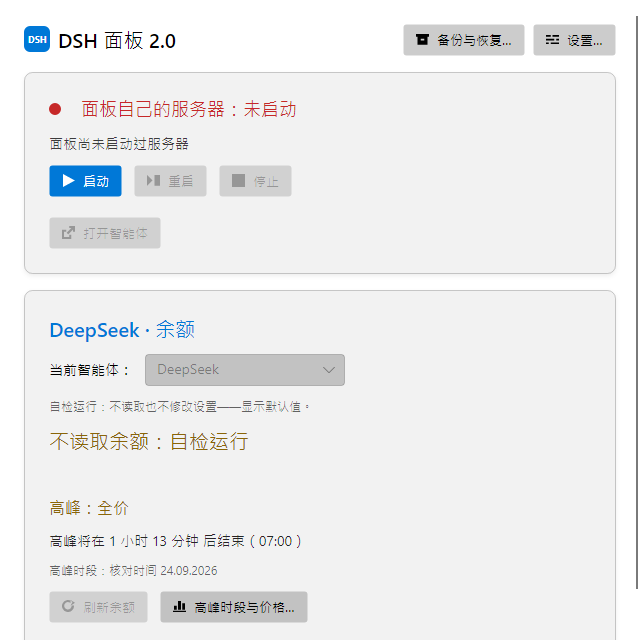

<p align="center">
  
</p>

<h1 align="center">DSH Panel</h1>

<p align="center">
  Windows 上本地 <b>DeepSeek Harness</b> 服务器的管理面板：<br>
  从托盘启动并看护服务器，显示余额与高峰时段，创建和恢复备份，并更新自己。
</p>

<p align="center">
  <a href="https://github.com/Danerus23/dsh-panel/releases/latest"></a>
  <a href="LICENSE"></a>
  
  
  <a href="https://github.com/Danerus23/dsh-panel/releases"></a>
</p>

<p align="center">
  <a href="#安装">安装</a> ·
  <a href="#功能">功能</a> ·
  <a href="#暂不具备">暂不具备</a> ·
  <a href="#界面截图">界面截图</a> ·
  <a href="#从源码构建">从源码构建</a> ·
  <a href="#支持这个项目">支持</a> ·
  <a href="README.md">English</a> ·
  <a href="README.ru.md">Русский</a>
</p>



面板版本 **2.0.0**。只有一个文件 `DshPanel.exe`；安装到用户配置文件里，不需要管理员权限，
也不需要单独安装 .NET——运行时就在程序内部。

面板支持三种语言——**俄语、英语和中文**。俄语是原文，而**英语和中文由机器翻译**：意思准确，
但个别措辞可能不够地道。

## 安装

1. 从[最新发布](../../releases/latest)下载安装程序 `dsh-panel-setup.exe` 并运行。它把面板
   **安装到当前用户的配置文件中**——`%LOCALAPPDATA%\Programs\DSH Panel`——并且**不要求管理员权限**。
2. 或者使用便携版压缩包 `DshPanel.zip`：解压到任意目录，运行 `DshPanel.exe` 即可，系统上不会留下
   其他改动。
3. 然后按 **“启动”**：面板会拉起你的 DSH 服务器并显示状态。登录链接由单独的按钮打开。

DSH Panel 2.0 **覆盖安装 1.x**：两者使用同一个包标识，因此托盘里只有一个面板，而不是两个。

**运行条件：** Windows 10 或 11，x64。不需要安装 .NET。还需要你自己已安装的 DSH——发布包里
不带引擎（见“暂不具备”）。

## 功能

### 服务器

启动、重启和停止本地 DSH 服务器。面板显示的是真实状态：正在运行、已停止，或端口被别的程序
占用。登录链接**只在你点击时**才在浏览器中打开——面板自己既不会打开它，也不会显示它。旁边是
服务器日志：可以看到它启动时输出了什么。

### 接管已在运行的 DSH

如果 DSH 服务器已经起来了，面板会在 3080 端口或其他端口上找到它，把发现的结果显示给你，并询问
是否接管。你的回答会被**记住**，下次启动时面板会直接接管同一个服务器。只要旁边还有别人的服务器
在响应，面板就不会再启动自己的服务器——同一份数据上不会出现第二个引擎。

### 托盘

托盘图标用颜色显示状态：绿色——服务器有响应，红色——没有响应，灰色——面板不知道服务器的情况。
图标角上还有一个高峰指示灯。点击图标打开窗口，右键打开菜单，菜单顶部有三行状态：服务器、
带余额的智能体，以及资费。关闭按钮和“最小化”都会把窗口收进托盘，服务器继续运行。

### 余额与高峰时段

余额用当前模型的密钥读取，按计划刷新。高峰时段按**你的本地时间**显示。面板会在高峰即将开始时
和余额低于阈值时通知你，也会说明距离资费切换还有多久。启动时，面板会用气泡告诉你它在运行。

### 价格与价格历史

“费用”表来自价格页面。除此之外，面板单独保存一份**变更历史**：只有当价格或高峰时段
**真的发生变化**时才会留下一条记录。每条新记录都与上一条对比，最新的一条标注为“当前”，
涨价用红色向上箭头表示，降价用绿色向下箭头表示。发生变化时，气泡会说明**到底变了什么**。

### 备份与恢复

DSH 数据的备份是一个 ZIP 压缩包。面板会列出已有的备份；恢复之前先给出计划：究竟会恢复什么、
恢复到什么地方，此时磁盘上什么都不改。恢复会先为当前状态做一份保险备份；自动备份按计划创建
并按数量轮换；备份体积有三种模式。`~/.dsh` 之外的**私钥**只有单独许可后才会进入备份，此时压缩
包本身就是密钥。**“用于分享的备份”是一次性的动作，而不是设置：**备份窗口里的勾选在备份完成后
会自动取消，没有窗口的备份有自己的 `--shareable` 参数，夜间自动备份永远不会是可分享的。这种
备份里根本不放入访问密钥文件，因此可以交给别人。**“私钥 + 分享”的组合被禁止**，面板会拒绝并
说明原因。

### 更新自己

面板每天自动查询一次发布，用**面板自己的语言**显示发行说明，并支持“跳过此版本”。下载的内容
会用 SHA-256 校验，解压时核对版本，文件替换由一个单独的脚本完成，**并且可以回退**到上一个
版本。替换结果面板会用文字说明：已更新、已回退，或者替换的不是面板所在的那个目录。

### 三种语言

俄语、英语和中文。语言在设置里选择。

### 报告问题

“关于”窗口里有一个报告按钮。面板会整理一份技术报告，并**把将要发出的文本原样显示给你**。
它不会自己发送任何东西：只有你按下按钮，报告才会走出去——在浏览器中打开新的 issue、复制，
或保存到文件。模型密钥、余额和登录链接都不会进入报告。

### 设置

随 Windows 启动、界面主题（浅色、深色或跟随 Windows）、自有服务器端口，以及服务器工作目录。
“服务器”一节里有环境报告：面板找过什么、找到了什么，DSH、Node、npm 和 pnpm 各是什么版本、
具体在什么路径下。

## 暂不具备

这里把话说明白，免得事后意外：

* **发布包里没有 DSH 引擎，也没有 Node。** 面板不携带它们：你需要自己已安装的 DSH。1.x 版的
  安装程序会一并装上引擎和 Node——这一版不会。
* **完全没有代码签名。** 首次运行时 SmartScreen 会提示发布者未知。这是预料之中的：没有购买
  签名证书。
* **不会更新 DSH 本身。** 面板只更新自己。
* **高峰时段表不认识中国的节假日。** 它是按星期排的——价格页面上也是这样排的。

## 界面截图

每个窗口都有三种语言。截图是在演示用的配置文件上拍的。


面板的多个窗口。

| | English | Русский | 中文 |
| --- | --- | --- | --- |
| 主窗口 | [panel](docs/screenshots/en/panel.png) | [панель](docs/screenshots/ru/panel.png) | [面板](docs/screenshots/zh/panel.png) |
| 高峰时段与价格 | [peaks](docs/screenshots/en/peaks.png) | [пики](docs/screenshots/ru/peaks.png) | [价格高峰](docs/screenshots/zh/peaks.png) |
| 价格历史 | [price history](docs/screenshots/en/pricing-history.png) | [история цен](docs/screenshots/ru/pricing-history.png) | [价格历史](docs/screenshots/zh/pricing-history.png) |
| 设置 | [settings](docs/screenshots/en/settings.png) | [настройки](docs/screenshots/ru/settings.png) | [设置](docs/screenshots/zh/settings.png) |
| 关于 | [about](docs/screenshots/en/about.png) | [о программе](docs/screenshots/ru/about.png) | [关于](docs/screenshots/zh/about.png) |
| 面板更新 | [update](docs/screenshots/en/update.png) | [обновление](docs/screenshots/ru/update.png) | [更新](docs/screenshots/zh/update.png) |

## 从源码构建

```powershell
git clone https://github.com/Danerus23/dsh-panel.git
cd dsh-panel

dotnet build DshPanel.slnx -c Release
dotnet test tests\DshPanel.Tests\DshPanel.Tests.csproj -c Release
dotnet publish src\DshPanel\DshPanel.csproj -p:PublishProfile=win-x64 -o dist
```

发布配置会产出单个自带运行时的 `DshPanel.exe`，.NET、Skia 和 HarfBuzz 都在里面——运行它的
机器不需要安装 .NET。

构建需要 **.NET SDK 10**（版本锁定在 `global.json` 里）和网络连接，因为包要从 NuGet 还原。
安装程序由 [Inno Setup 7](https://jrsoftware.org/isdl.php) 通过 `installer\build-installer.ps1`
构建，发布文件同样由它放进 `dist\`。Node 和 pnpm 是用来启动服务器的，不是用来构建面板的。

## 支持这个项目

面板免费、开源，并且会一直如此——没有付费版本，也没有这个打算；捐赠用于开发时间：
代码、构建和在干净 Windows 上的验证，通过 [lava.top](https://app.lava.top/3686297587)。

> **非官方工具。** DSH Panel 是为 DeepSeek Harness 智能体做的面板：它调用官方的 `dsh`
> 命令行，不修改它。DeepSeek 和 DeepSeek Harness 是其所有者的商标。

## 许可证

MIT——见 [LICENSE](LICENSE)。
